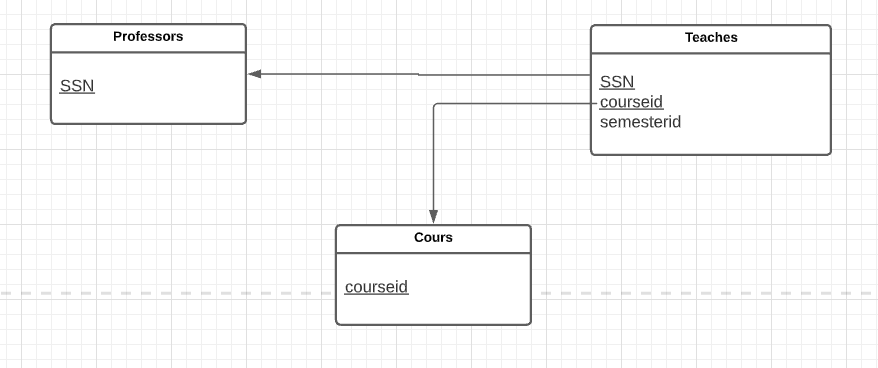
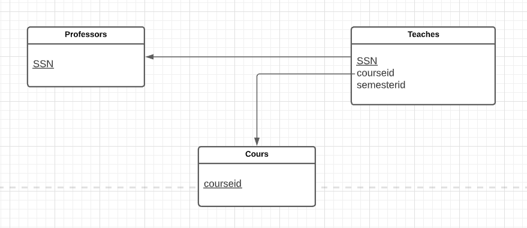
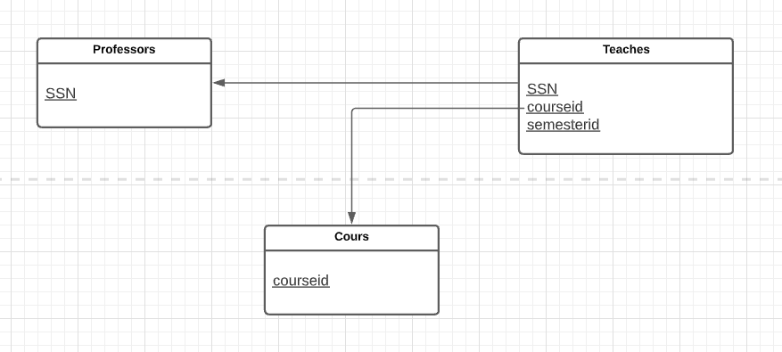
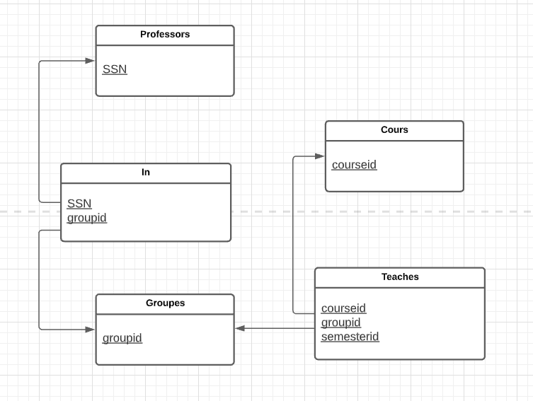

# CSI2532-playground
Repository for the labs of Database 1

Félix Larouche: 300144353

# Laboratoire 4

## Exercice 1
Les professeurs peuvent enseigner le
même cours sur plusieurs semestres et seule
la plus récente doit être enregistrée.

Request SQL:

`CREATE TABLE professors(ssn integer, primary key (ssn));`

`CREATE TABLE courses(courseid varchar(100), primary key(courseid));`

`CREATE TABLE teaches(ssn integer, courseid varchar(100), semesterid varchar(100), primary key(ssn, courseid), foreign key (ssn) references professors, foreign key (courseid) references courses);`

## Exercice 3
Chaque professeur enseigne exactement
un cours (ni plus, ni moins).

Request SQL:

`CREATE TABLE professors(ssn integer, primary key (ssn));`

`CREATE TABLE courses(courseid varchar(100), primary key(courseid));`

`CREATE TABLE teaches(ssn integer, courseid varchar(100), semesterid varchar(100), primary key(ssn), foreign key (ssn) references professors, foreign key (courseid) references courses);`

## Exercice 5
Les professeurs peuvent enseigner le
même cours sur plusieurs semestres et
chaque doit être enregistrée.

Request SQL:

`CREATE TABLE professors(ssn integer, primary key (ssn));`

`CREATE TABLE courses(courseid varchar(100), primary key(courseid));`

`CREATE TABLE teaches(ssn integer, courseid varchar(100), semesterid varchar(100), primary key(ssn, courseid, semesterid), foreign key (ssn) references professors, foreign key (courseid) references courses);`

## Exercice 6
Supposons maintenant que certains cours
puissent être enseignés conjointement par
une équipe de professeurs, mais il est
possible qu'aucun professeur dans une
équipe ne puisse enseigner le cours.
Modélisez cette situation en introduisant des
ensembles d'entités et des ensembles de
relations supplémentaires si nécessaire.

Request SQL:

`CREATE TABLE professors(ssn integer, primary key (ssn));`

`CREATE TABLE courses(courseid varchar(100), primary key(courseid));`

`CREATE TABLE groupes(groupid varchar(100), primary key (groupid));`

`CREATE TABLE in(ssn integer, groupid varchar(100), primary key(ssn, groupid), foreign key (ssn) references professors, foreign key (groupid) references groupes);`

`CREATE TABLE teaches(groupid integer, courseid varchar(100), semesterid varchar(100), primary key(groupid, courseid, semesterid), foreign key (groupid) references groupes, foreign key (courseid) references courses);`

