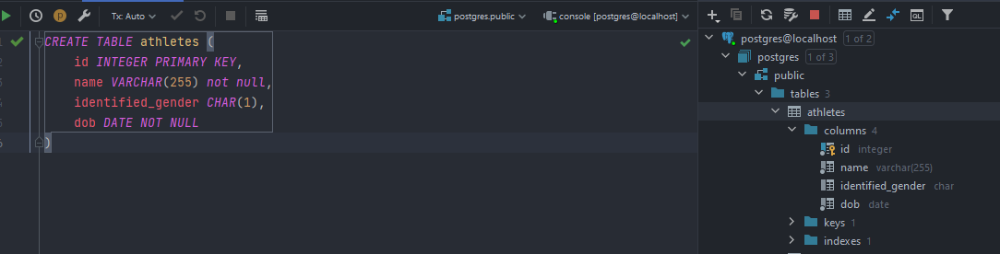
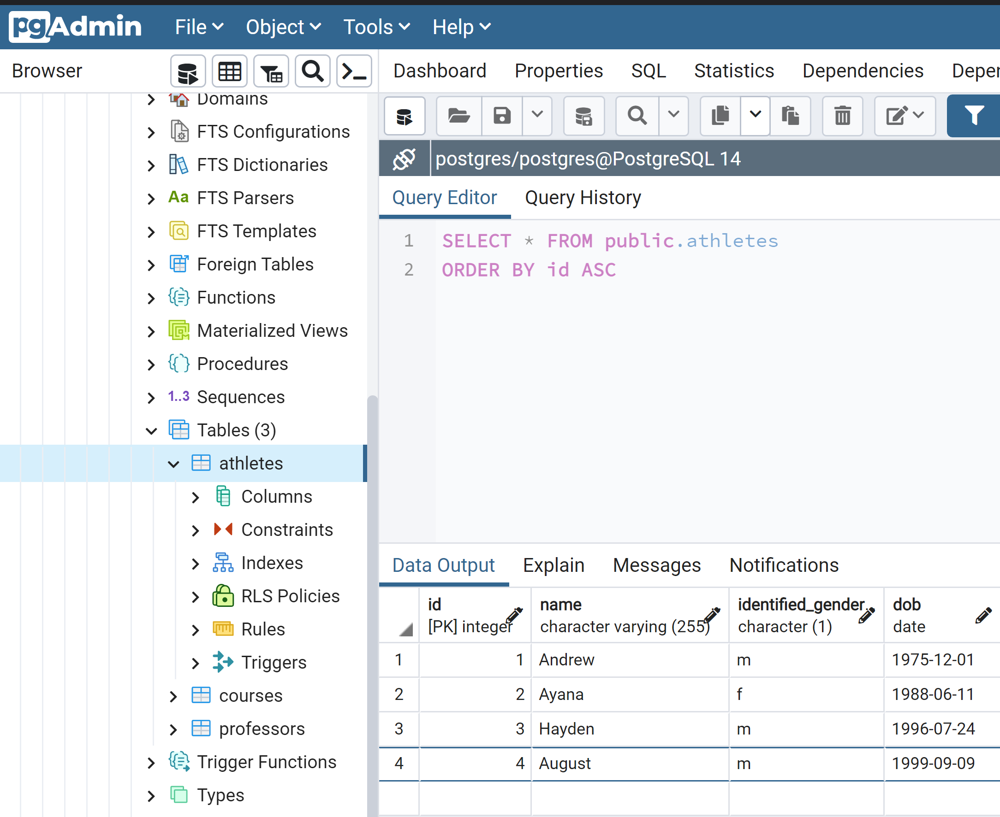
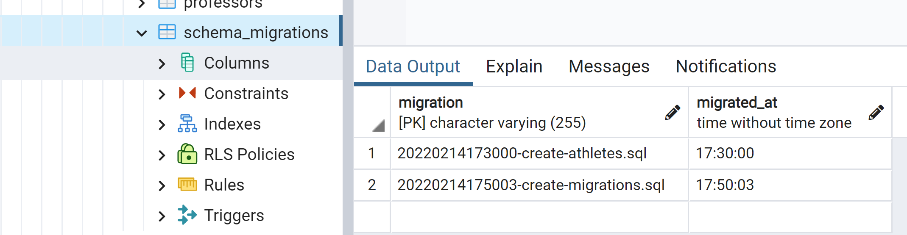
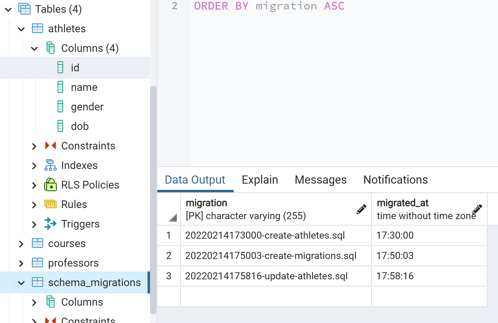
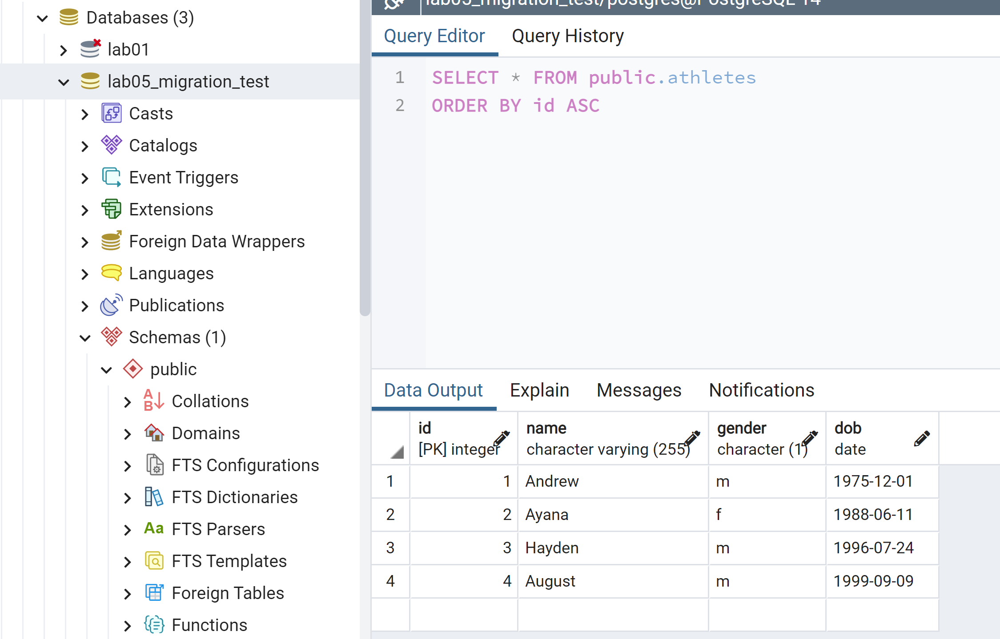

# CSI2532-playground
Repository for the labs of Database 1

Félix Larouche: 300144353

# Laboratoire 5

## Créer la base de donnée Athletes

## Ajouter des valeurs dans la base de donnée Athletes

## Créer la base de donnée schema_migration et y ajouter des valeurs

## Update Athletes pour que identified_gender soit gender & ajouter cette migration dans schema_migration

## Créer une nouvelle database lab5_migration_test et executer schema.sql

