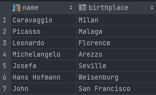
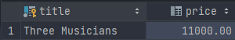
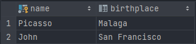
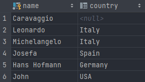
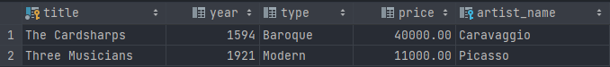
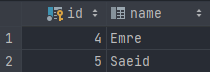
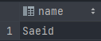

# CSI2532-playground
Repository for the labs of Database 1

Félix Larouche: 300144353

# Laboratoire 6

## Exercice 1

### Query
`SELECT name, birthplace FROM artists`

### Résultat

## Exercice 2

### Query
`SELECT title, price FROM artworks WHERE year > 1600`

### Résultat

## Exercice 3

### Query
`SELECT title, price FROM artworks WHERE year > 1600 OR artist_name = 'Picasso'`

### Résultat

## Exercice 4

### Query
`SELECT name, birthplace FROM artists WHERE EXTRACT(YEAR FROM dateofbirth) BETWEEN 1880 AND 1930`

### Résultat

## Exercice 5

### Query
`SELECT name, country FROM artists WHERE style IN ('Baroque', 'Modern', 'Renaissance')`

### Résultat

## Exercice 6

### Query
`SELECT * FROM artworks ORDER BY title`

### Résultat

## Exercice 7

### Query
`SELECT c.id, c.name from customers c, likeartists l WHERE c.id = l.customer_id AND artist_name = 'Picasso'`

### Résultat

## Exercice 8

### Query
`SELECT c.name from customers c, likeartists l, artists a WHERE c.id = l.customer_id AND l.artist_name = a.name AND a.style = 'Renaissance' AND c.amount > 30000`

### Résultat

